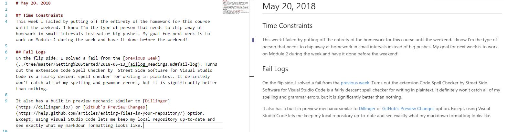

# May 20, 2018

This week I failed by putting off the entirety of the homework for this course until the weekend. I know I'm the type of person that needs to chip away at homework in small intervals instead of big pushes. My goal for next week is to work on Module 2 during the week and have it done before the weekend!

On the flip side, I solved a fail from the [previous week][0]. Turns out the extension Code Spell Checker by Street Side Software for Visual Studio Code is a fairly decent spell checker for writing in plaintext. It definitely won't catch all of my spelling and grammar errors, but it is significantly better than nothing.

It also has a built in preview mechanic similar to [Dillinger][1] or [GitHub's Preview Changes][2] option. Except, using Visual Studio Code lets me keep my local repository up-to-date without having to constantly fetch from my online repository and I still get to see exactly what my markdown formatting looks like.

[0]: ../Getting%20Started/README.md#notes
[1]: https://dillinger.io/
[2]: https://help.github.com/articles/editing-files-in-your-repository/